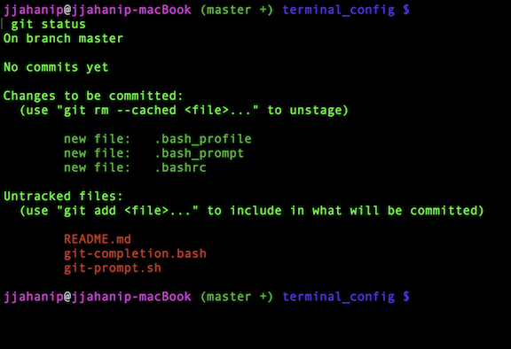

# My costum terminal configuration for Mac & Linux

These are my costumized dotfiles for Mac and Linux terminal.

git-prompt.sh and git-completion.bash files are taken from [git repository](https://github.com/git/git/tree/master/contrib/completion)



## Install
**Warning:** please review the code and remove things you don't want or need. Don't blindly copy and paste the files if you don't know what it entails. Use at your own risk.

* If you want to use a fresh termnial, you can simply copy all files to your home directory:
```
git clone https://github.com/jjahanip/terminal_config ~/terminal_config
cd ~/terminal_config
cp * ../
```
* If you want to keep your variables in your *.bashrc* or *.bash_profile* files, you can append the lines to your existing file:
```
git clone https://github.com/jjahanip/terminal_config ~/terminal_config
cd ~/terminal_config
cat .bash_profile >> ../.bash_profile
cat .bashrc >> ../.bashrc
cp git-* ../
```

** Hope you enjoy !**


